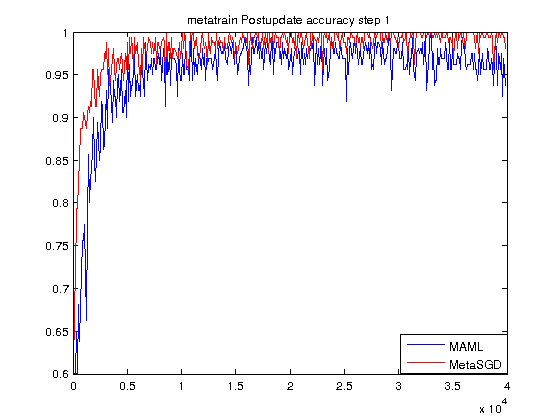
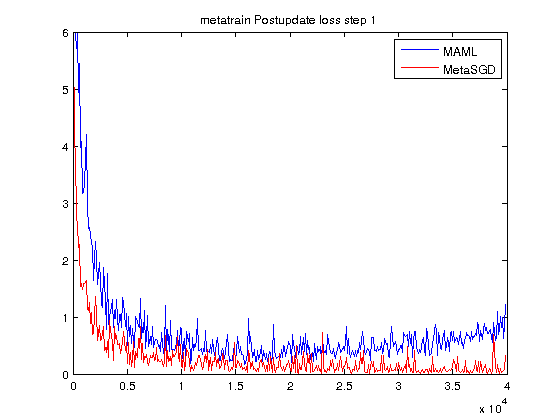
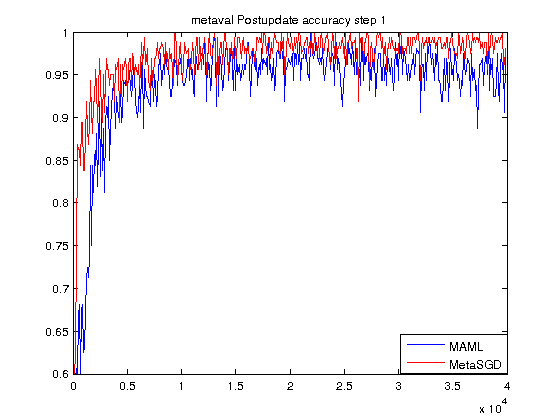
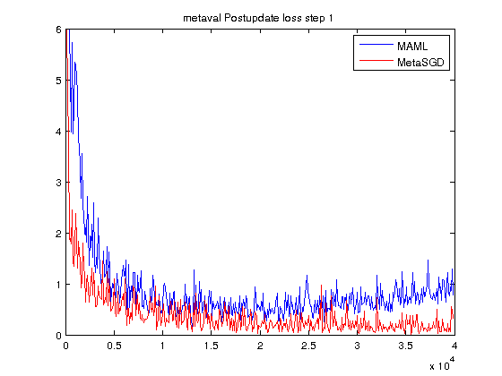
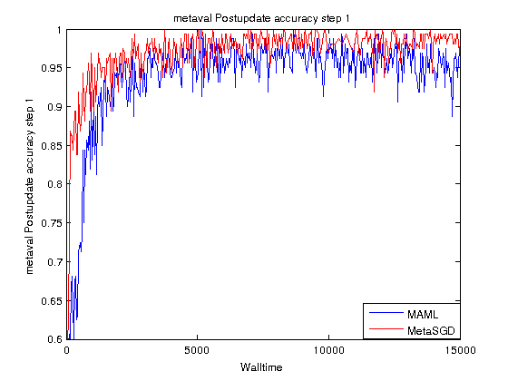

Meta-SGD([Meta-SGD: Learning to Learn Quickly for Few Shot Learning(Zhenguo Li et al.)](https://arxiv.org/abs/1707.09835)) experiment on Omniglot classification compared with MAML([Model-Agnostic Meta-Learning for Fast Adaptation of Deep Networks (Finn et al., ICML 2017)](https://arxiv.org/abs/1703.03400))

code from [MAML](https://github.com/cbfinn/maml)

data from [Omniglot](https://github.com/brendenlake/omniglot)

tips: some difference with the paper [Meta-SGD: Learning to Learn Quickly for Few Shot Learning(Zhenguo Li et al.)](https://arxiv.org/abs/1707.09835), the meta-update datas do not come from the seperate dataset.

### Usage

```
python main.py --datasource=omniglot --metatrain_iterations=40000 --meta_batch_size=32 --update_batch_size=1 --update_lr=0.4 --num_updates=1 --logdir=logs/omniglot5way/

```
```
python main.py --datasource=omniglot --metatrain_iterations=40000 --meta_batch_size=32 --update_batch_size=1 --update_lr=0.4 --num_updates=1 --logdir=logs/omniglot5way/  --train=False --test_set=True

```

### metaSGD and MAML

all the x label in the figure is iteration step.









considering the time cost other than the iteration step:


- we can see that the convergence speed and performance of metaSGD is better than MAML
- the result in both iteration and time scale is the same
- other than MAML, performance of meta-SGD won't get worst in long-term training.